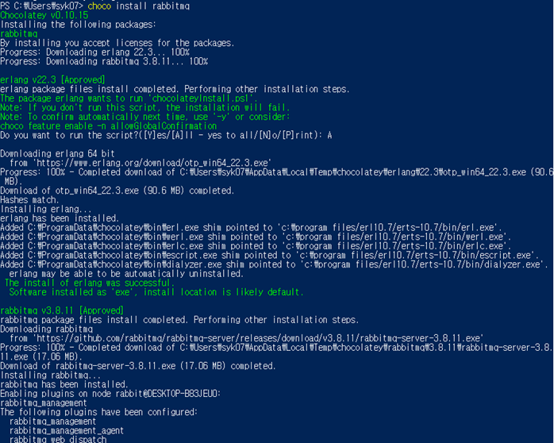
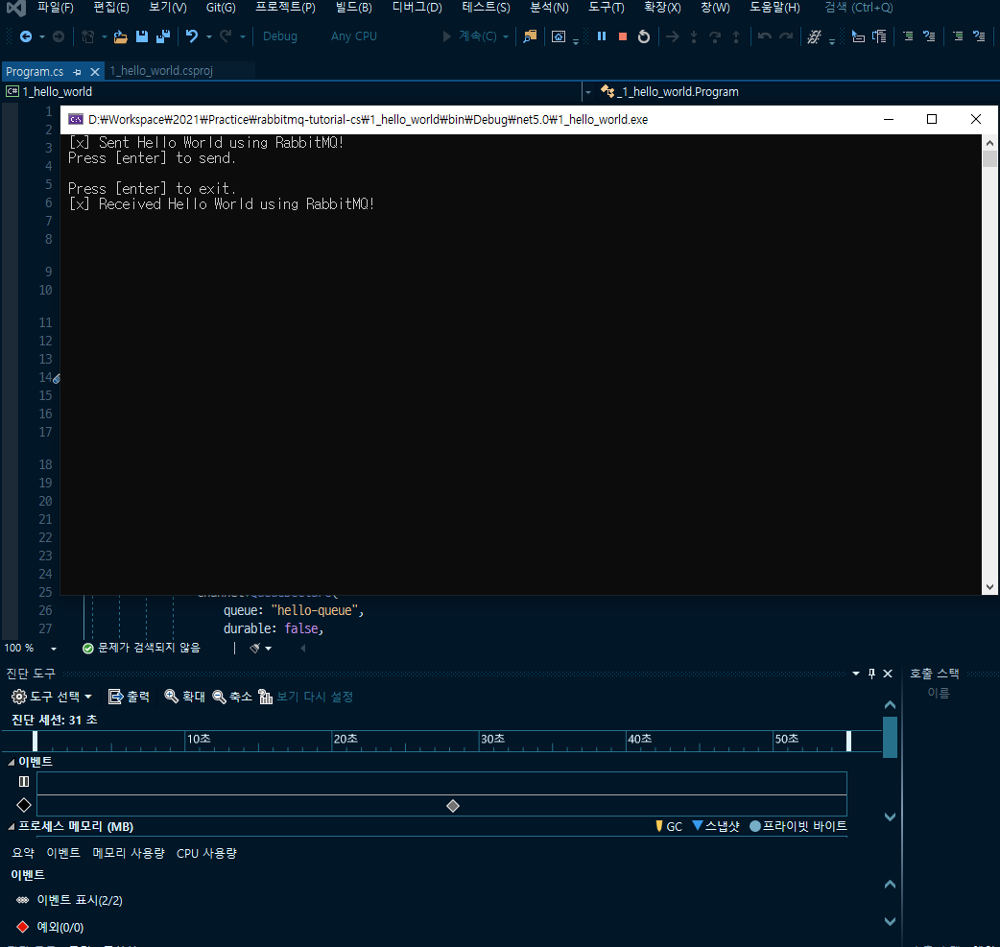

# rabbitmq-tutorial-cs
This is rabbitmq tutorial in .net 5.0


### Requirements

.net 5.0


### How to Build

If you haven't installed Chocolatey, install it first.

[Installing Chocolatey](https://chocolatey.org/install)

```powershell
Set-ExecutionPolicy Bypass -Scope Process -Force; [System.Net.ServicePointManager]::SecurityProtocol = [System.Net.ServicePointManager]::SecurityProtocol -bor 3072; iex ((New-Object System.Net.WebClient).DownloadString('https://chocolatey.org/install.ps1'))
```


Then, install RabbitMQ in Powershell.

[Installing on Windows — RabbitMQ](https://www.rabbitmq.com/install-windows.html)

```powershell
choco install rabbitmq
```




Then you can run the solution file and then debug it can be debugged.

